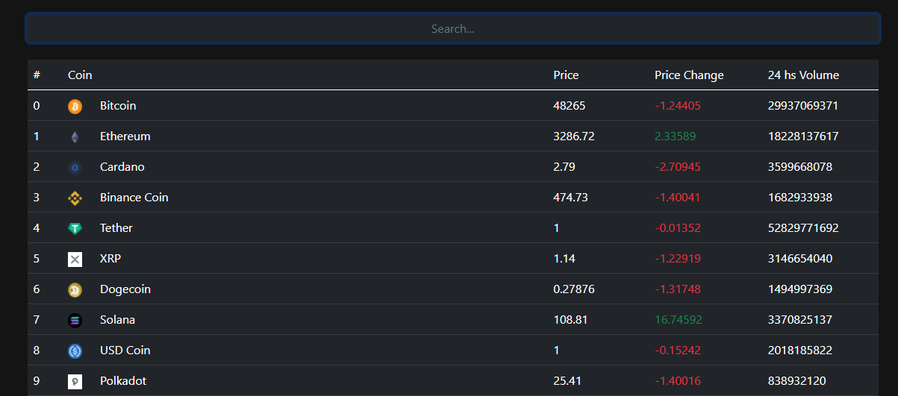
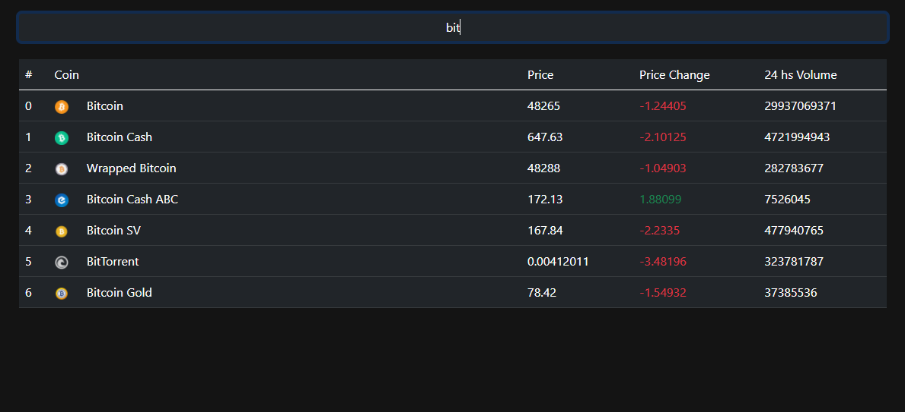

# Getting Started with Create React App

This project was bootstrapped with [Create React App](https://github.com/facebook/create-react-app).

## App para visualizar variaciones en criptomonedas 

Esta aplicacion se realizo con create-react-app, se uso axios para hacer las peticiones a una  API de criptomonedas llamada Coingecko.
Tambien se uso Bootstrap para darle estilo.   

## Filtrado de Monedas

